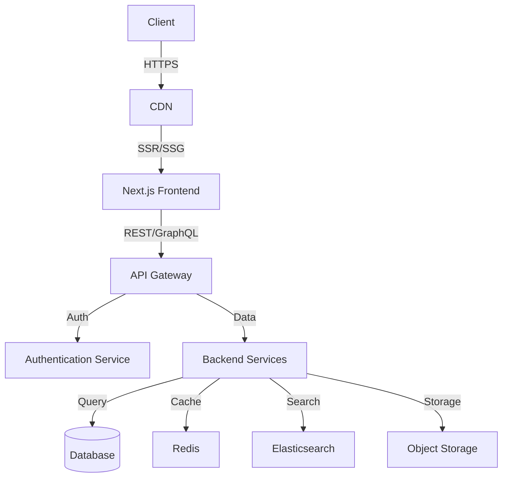

# System Architecture

## Overview
The MmabiaaCares platform is built using a modern, scalable architecture that separates concerns and enables independent scaling of components.

## High-Level Architecture

## Core Components

### 1. Frontend Layer
- **Next.js Application**
  - Server-side rendering (SSR)
  - Static site generation (SSG)
  - Client-side navigation
  - Progressive Web App (PWA) support

### 2. API Layer
- **API Gateway**
  - Request routing
  - Rate limiting
  - Request/response transformation
  - Caching

### 3. Service Layer
- **User Service**
  - Authentication & authorization
  - Profile management
  - Session handling

- **Donation Service**
  - Payment processing
  - Donation tracking
  - Receipt generation

- **Program Service**
  - Program management
  - Impact tracking
  - Reporting

### 4. Data Layer
- **PostgreSQL**
  - Primary data store
  - ACID compliance
  - Replication for high availability

- **Redis**
  - Session storage
  - Caching layer
  - Rate limiting

- **Object Storage**
  - Media files
  - Documents
  - Backups

## Data Flow

1. **User Request Flow**
   - Request hits CDN
   - Served from cache if available
   - Rendered by Next.js (SSR/SSG)
   - Client-side navigation for subsequent requests

2. **API Request Flow**
   - Request authenticated at API Gateway
   - Routed to appropriate service
   - Data retrieved from cache or database
   - Response formatted and returned

## Scalability Considerations

### Horizontal Scaling
- Stateless services for easy scaling
- Database read replicas
- Caching strategy

### Performance Optimization
- CDN for static assets
- Database indexing
- Query optimization

### Availability
- Multi-region deployment
- Automated failover
- Regular backups

## Security Architecture

### Network Security
- VPC with private subnets
- Security groups and NACLs
- WAF protection

### Data Protection
- Encryption at rest
- Encryption in transit (TLS 1.3+)
- Regular security audits

### Access Control
- Role-based access control (RBAC)
- Principle of least privilege
- Regular access reviews

## Monitoring & Observability

### Logging
- Structured logging
- Centralized log management
- Retention policies

### Metrics
- Application metrics
- System metrics
- Business metrics

### Tracing
- Distributed tracing
- Performance monitoring
- Error tracking

## Deployment Architecture

### Environments
1. **Development**
   - Feature branches
   - Developer sandboxes

2. **Staging**
   - Integration testing
   - UAT

3. **Production**
   - Blue/green deployment
   - Canary releases
   - Feature flags

### CI/CD Pipeline
- Automated testing
- Security scanning
- Infrastructure as Code (IaC)
- Deployment automation

## Future Considerations

### Scalability
- Microservices architecture
- Event-driven architecture
- Serverless components

### Performance
- Edge computing
- Database sharding
- Advanced caching strategies

### Security
- Zero-trust architecture
- Advanced threat detection
- Compliance automation
